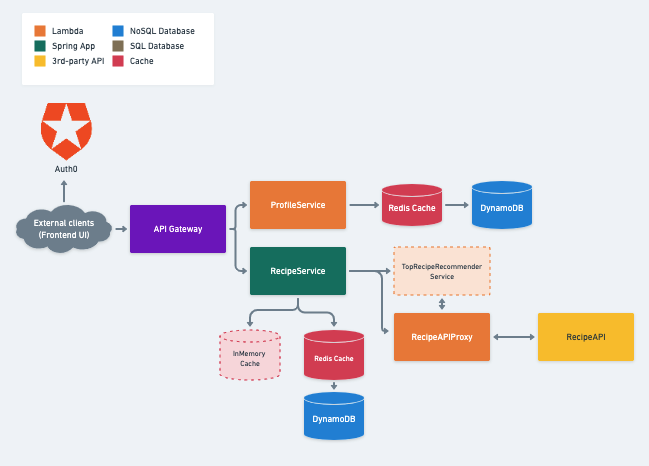

# Recipeasy
#### Contributors: Brandon Clark, Jonathan Sepik, Jerrett Gonsalves

Tired of not knowing what to make for dinner or continuously getting take-out while the ingredients you planned on using
in your fridge go to waste? Then try out Recipeasy! Recipeasy is a web application that helps you find recipes to make
using the ingredients you already have in your fridge. You can create your profile, add your ingredients from your fridge
to your profile, add your dietary preferences, and you'll get custom recipe recommendations that help you save money and
save our planet. Perhaps you haven't gone grocery shopping, but you know you're going to be buying some ingredients that you 
want to use for multiple meals. Not a problem! You can use our search page to find recipes that utilize the ingredients
you want to cook with, without having to be logged-in.

### Features

- Search for recipes by ingredients.
- Search for recipes by dietary restrictions, cuisine, meal-type.
- Create and update your profile information such as name, email, and dietary restrictions.
- Add, Update, Remove ingredients from your fridge to your profile including ingredient name, unit measurement, quantity, date purchased.
- Favorite/Unfavorite recipes to your profile for ease of access later on.

### Languages used:
- Java
- JavaScript
- HTML
- CSS

### Technologies and Frameworks used:
- Auth0
- AWS CodePipeline
- AWS DynamoDB
- AWS Lambda
- Dagger
- Express.js
- Gradle
- Node.js
- Redis
- Spring Boot
- Webpack
- Yarn

### Expansion:
- Create a Today's Top Recommendations based on the most saved recipes

## Demo videos:
#### Landing Page:

https://github.com/JerrettG/Recipeasy_Capstone_Project/assets/100180211/1eadb956-ba2f-459a-977e-f7ef3f2ca796

#### Searching Recipes:

https://github.com/JerrettG/Recipeasy_Capstone_Project/assets/100180211/333c1e27-a544-41fe-8879-705064801e28

#### Recipe Page:

https://github.com/JerrettG/Recipeasy_Capstone_Project/assets/100180211/50e75595-b898-45a5-b66f-63def6480541

#### Visiting your profile:

https://github.com/JerrettG/Recipeasy_Capstone_Project/assets/100180211/7b28297a-6a75-46ef-b19a-8140f7a844d2

#### Adding/Updating/Removing ingredients:

https://github.com/JerrettG/Recipeasy_Capstone_Project/assets/100180211/59f12a2c-d051-4293-adb1-9a81639f2fe8

#### Removing a saved recipe:

https://github.com/JerrettG/Recipeasy_Capstone_Project/assets/100180211/246cfdd7-2043-45c6-bbe1-62ddcc9a1eca

## Design:

